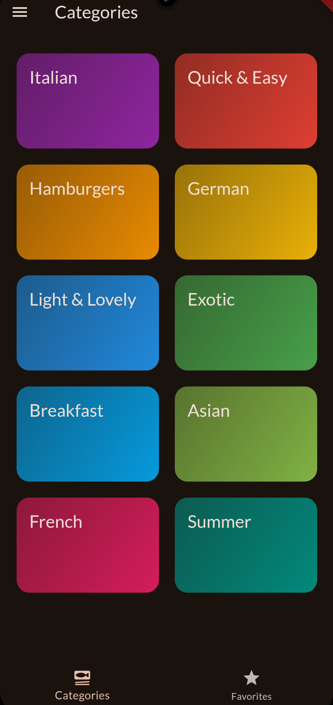
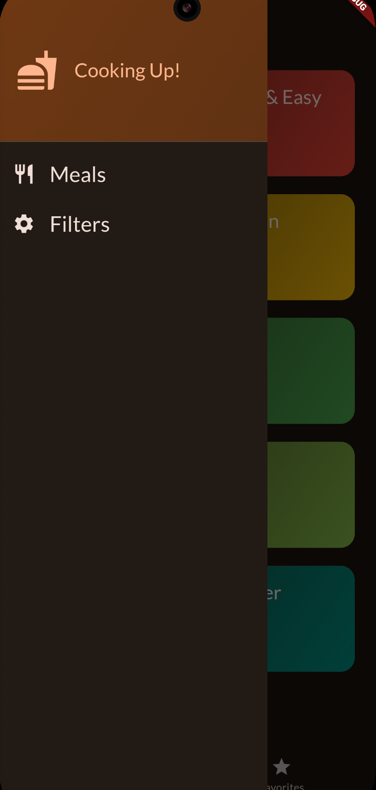
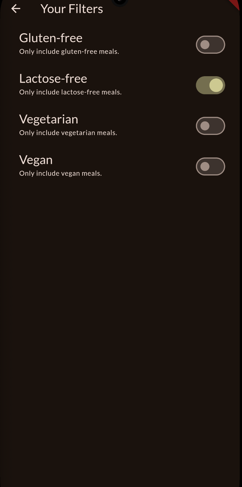
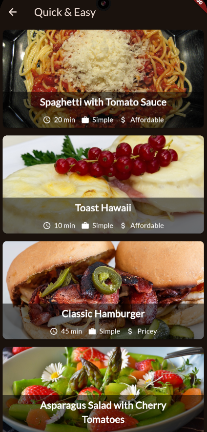
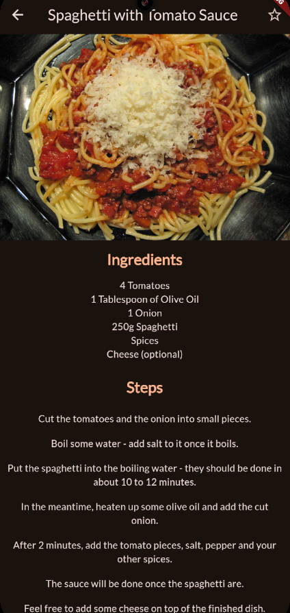
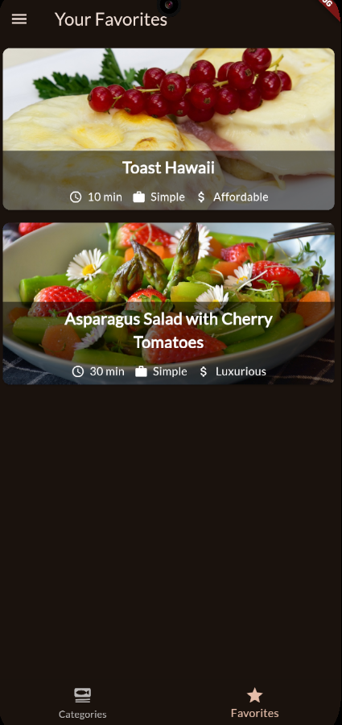

# Meals App

Flutter project:

- side bar with filter meals function
- bottom bar with different screen route
- able add meals into favorites meal list
- using provider for passing variable/trigger between widget
- implicate/explicate animation

---

---

